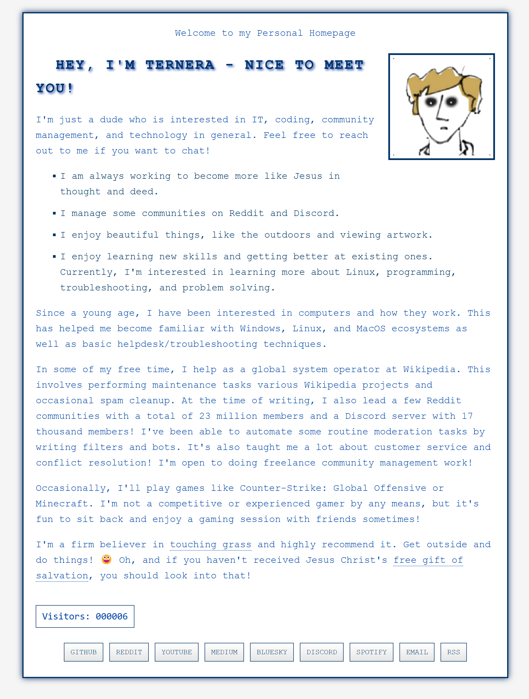

# Ternera's Retro Website

This project is a nostalgic 2000s-era personal website built with Next.js, TypeScript, and React.

Demo Link: https://retro.ternera.org



## Features

- 🎨 Retro 2000s-style design with modern responsiveness
- 👤 Profile section with personal information
- 🔢 Real-time visitor counter (innacurate)
- 🔗 Social media links
- 📱 Mobile-friendly layout
- 🎯 Fast loading and SEO-friendly (Next.js)
- 🖼️ Optimized image loading
- 📄 MDX support for content

## Tech Stack

- Next.js
- TypeScript
- React
- CSS
- MDX

## Prerequisites

Before you begin, ensure you have the following installed:
- Node.js (version 14.x or higher)
- npm (usually comes with Node.js)

## Installation

1. Clone the repository:
   ```bash
   git clone https://github.com/ternera/retro-website.git
   cd website-old
   ```

2. Install dependencies:
   ```bash
   npm install
   ```

3. Create necessary files:
   - Add your profile picture as `profile.png` in the `public` directory
   - Add your favicon as `favicon.ico` in the `public` directory

4. Update social media links:
   Edit `src/pages/index.tsx` and update the social media URLs to your profiles.

## Development

To run the development server:

```bash
npm run dev
```

Open [http://localhost:3000](http://localhost:3000) in your browser to see the result.

## Building for Production

To create a production build:

```bash
npm run build
```

To start the production server:

```bash
npm start
```

## Deployment

This project is ready to be deployed on Vercel:

1. Push your code to a GitHub repository
2. Import the project in Vercel
3. Deploy

Note: The visitor counter in this demo version uses an in-memory store which resets on server restart. For a production environment, you should implement a persistent storage solution (e.g., a database).

## Customization

- **Colors**: Edit `src/styles/retro.css` to change the color scheme
- **Content**: Modify `src/pages/index.tsx` to update the page content
- **Layout**: Adjust the CSS in `src/styles/retro.css` to modify the layout

## Contributing

Feel free to submit issues and pull requests!

## Acknowledgments

- Inspired by personal websites from the 2000s era